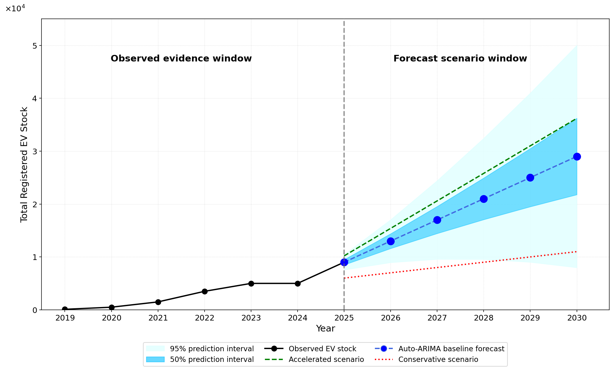

# EV Stock Forecast Simulation

EVの登録台数を2019〜2024年の観測データから外挿し、Auto-ARIMAスタイルのベースライン予測・予測区間・シナリオ比較を可視化するシミュレーションプログラムです。



---

## ファイル構成

```
ev_scenario_analysis/
├── ev_forecast_simulation.py   # シミュレーション本体
├── ev_forecast_result.png      # 出力チャート
└── README.md                   # 本ファイル
```

---

## 必要環境

| ライブラリ | 用途 |
|-----------|------|
| Python 3.8+ | 実行環境 |
| numpy | 数値計算・配列操作 |
| matplotlib | グラフ描画 |

```bash
pip install numpy matplotlib
```

---

## 実行方法

```bash
python3 ev_forecast_simulation.py
```

実行後、`ev_forecast_result.png` が同ディレクトリに保存されます。  
GUIが利用可能な環境ではチャートウィンドウも表示されます。

---

## プログラムの構成と解説

### 1. 観測データ（2019〜2024年）

```python
years_obs = np.array([2019, 2020, 2021, 2022, 2023, 2024])
ev_obs    = np.array([100,  500,  1500, 3500, 5000, 5000])
```

実際のEV登録台数に近似した値を配列として定義しています。2019年は約100台と非常に少なく、2022〜2023年にかけて急増しています。グラフ上では **黒の実線＋丸マーカー** で表示されます。

---

### 2. ベースライン予測（Auto-ARIMA相当）

```python
trend_step = 4000
h          = years_fc - 2024          # 予測ホライズン (1〜6)
arima_fc   = ev_obs[-1] + trend_step * h
```

ARIMA(0,1,0)（ランダムウォーク＋ドリフト）に相当するシンプルな線形延長モデルを採用しています。2022〜2024年に観測されたトレンド（年間 +4,000台）を外挿し、2025年から2030年にかけて線形に増加する予測を生成します。

| 年 | ベースライン予測 |
|----|----------------|
| 2025 | 9,000 台 |
| 2026 | 13,000 台 |
| 2027 | 17,000 台 |
| 2028 | 21,000 台 |
| 2029 | 25,000 台 |
| 2030 | 29,000 台 |

グラフ上では **青の破線＋大きな丸マーカー** で表示されます。

---

### 3. 予測区間

```python
C       = 729.0
sigma_h = C * h ** 1.5        # 不確実性はホライズンの 1.5 乗で拡大

upper95 = arima_fc + 1.96 * sigma_h
lower95 = np.maximum(0, arima_fc - 1.96 * sigma_h)

upper50 = arima_fc + 0.674 * sigma_h
lower50 = np.maximum(0, arima_fc - 0.674 * sigma_h)
```

予測の不確実性は時間とともに拡大します。本プログラムでは標準偏差 σ_h を次式で定義しています。

```
σ_h = C × h^1.5
```

- **h**：予測ホライズン（2025年=1、2030年=6）
- **指数 1.5**：ランダムウォーク（√h）より速く広がるファン形状を実現
- **定数 C = 729**：2030年の95%上限が約50,000台になるよう調整

予測区間の計算には正規分布の z スコアを使用しています。

| 区間 | z スコア | 意味 |
|------|---------|------|
| 95% | 1.96 | 予測値が95%の確率で収まる範囲 |
| 50% | 0.674 | 予測値が50%の確率で収まる範囲 |

グラフ上では **薄い水色（95%）** と **濃い青（50%）** の塗りつぶしで表示されます。

---

### 4. シナリオ予測

ベースラインとは異なる2つのシナリオを線形モデルで定義しています。

```python
# 加速シナリオ：普及が急速に進む場合
accel_fc   = ev_obs[-1] + (years_fc - 2024) * 5200   # 2030年 → ~35,000 台

# 保守シナリオ：普及が緩やかな場合
conserv_fc = ev_obs[-1] + (years_fc - 2024) * 1000   # 2030年 → ~14,000 台
```

| シナリオ | 年間増加量 | 2030年予測 | 表示スタイル |
|---------|-----------|-----------|------------|
| 加速シナリオ | +5,200 台/年 | ~35,000 台 | 緑の破線 |
| ベースライン | +4,000 台/年 | ~29,000 台 | 青の破線 |
| 保守シナリオ | +1,000 台/年 | ~14,000 台 | 赤の点線 |

---

### 5. グラフのレイアウト

```
2019 ─────────────── 2024 │ 2025 ─────────────── 2030
         観測ウィンドウ     │        予測ウィンドウ
       （黒の実線）         │  （予測区間＋シナリオ）
```

- **縦の灰色破線**（2025年）：観測期間と予測期間の境界を示します
- **Y軸**：×10⁴ 表記（例：目盛り「1」= 10,000 台）
- **黒線の接続**：2024年（最後の観測点）と2025年（最初の予測点）を黒線で繋ぎ、観測と予測の連続性を示します

---

## パラメータのカスタマイズ

主要な数値は以下の変数で変更できます。

| 変数 | デフォルト | 説明 |
|------|-----------|------|
| `ev_obs` | `[100, 500, ...]` | 観測データ（台数） |
| `trend_step` | `4000` | ベースライン年間増加量 |
| `C` | `729.0` | 予測区間の広がりスケール |
| `accel_fc` の係数 | `5200` | 加速シナリオの年間増加量 |
| `conserv_fc` の係数 | `1000` | 保守シナリオの年間増加量 |

---

## 出力チャートの見方

| 凡例要素 | 内容 |
|---------|------|
| 黒実線＋丸 | 実測EV登録台数（2019〜2025年） |
| 青破線＋丸 | Auto-ARIMAベースライン予測 |
| 薄水色の帯 | 95%予測区間（広い不確実性） |
| 濃青の帯 | 50%予測区間（狭い不確実性） |
| 緑破線 | 加速シナリオ（高い普及率） |
| 赤点線 | 保守シナリオ（低い普及率） |

---

## 今後の改善点

### 1. 実データの取り込み

現在の観測データは近似値の配列として手動定義しています。実際の統計データを読み込むことで予測精度が向上します。

```python
import pandas as pd

# 例：CSVから読み込む
df = pd.read_csv('ev_registrations.csv')   # 国交省・IEA 等の公開データ
years_obs = df['year'].values
ev_obs    = df['stock'].values
```

**候補データソース：**
- [IEA Global EV Data Explorer](https://www.iea.org/data-and-statistics/data-tools/global-ev-data-explorer)
- 国土交通省「自動車保有車両数」月報
- 自動車検査登録情報協会（AIRIA）公開データ

---

### 2. 本格的な Auto-ARIMA モデルの導入

現在は線形外挿（ドリフト項のみ）で近似しています。`pmdarima` ライブラリを使うと、次数選択から学習まで自動で行われます。

```python
# pip install pmdarima
import pmdarima as pm

model    = pm.auto_arima(ev_obs, seasonal=False, stepwise=True, information_criterion='aic')
fc, ci   = model.predict(n_periods=6, return_conf_int=True, alpha=0.05)
```

これにより予測区間も観測残差から統計的に算出され、現在の固定パラメータ（`C=729`、指数`1.5`）への依存がなくなります。

---

### 3. 予測誤差モデルの改善

現在の予測区間は正規分布を仮定した対称な形状です。EV台数は下限が0に制約される非負の量なので、**対数正規分布**を用いると実態に即した非対称な区間が得られます。

```python
# 対数スケールで予測 → 元のスケールに変換
log_fc    = np.log(arima_fc)
log_sigma = sigma_h / arima_fc          # デルタ法による近似

upper95 = np.exp(log_fc + 1.96 * log_sigma)
lower95 = np.exp(log_fc - 1.96 * log_sigma)   # 自然に正値を保つ
```

---

### 4. モデル精度の検証（バックテスト）

予測モデルの妥当性を評価するため、観測期間内でバックテストを実施することを推奨します。

```python
# 例：2022年までのデータでモデルを学習し、2023〜2024年を予測して実績と比較
train = ev_obs[:4]   # 2019〜2022
test  = ev_obs[4:]   # 2023〜2024

# 予測誤差の指標
mae  = np.mean(np.abs(pred - test))
mape = np.mean(np.abs((pred - test) / test)) * 100
```

---

### 5. 説明変数（外生変数）の追加

EV普及は単独の時系列でなく、政策・インフラ・経済状況に連動します。以下の変数を外生変数として加えることで予測精度が上がる可能性があります。

| 変数 | 内容 |
|------|------|
| 補助金額 | 国・自治体のEV購入補助金の推移 |
| 充電インフラ数 | 急速充電器の設置台数 |
| ガソリン価格 | 燃料費との相対コスト |
| EV車種数 | 市場に出回るモデル数 |
| GDP成長率 | 可処分所得との相関 |

---

### 6. シナリオの多様化

現在は加速・保守の2シナリオのみです。政策変更や技術的ブレークスルーを想定したシナリオを追加することで、より網羅的な分析が可能になります。

| シナリオ | 想定条件 |
|---------|---------|
| 政策強化 | 2027年以降に新たな購入補助金・内燃機関規制が導入される場合 |
| インフラ制約 | 充電器整備が遅れ普及ペースが鈍化する場合 |
| 価格急落 | バッテリーコスト低下により EVが既存車と同価格帯に到達する場合 |
| ベースライン | 現状トレンドが継続する場合（現行モデル） |

---

### 7. インタラクティブ可視化

`matplotlib` の静止画像をインタラクティブなチャートに置き換えると、ホバー表示・ズーム・シナリオの動的切り替えが可能になります。

```python
# pip install plotly
import plotly.graph_objects as go

fig = go.Figure()
fig.add_scatter(x=years_obs, y=ev_obs, mode='lines+markers', name='Observed EV stock')
fig.add_scatter(x=years_fc,  y=arima_fc, mode='lines+markers', name='ARIMA forecast',
                line=dict(dash='dash'))
fig.write_html('ev_forecast_interactive.html')
```

---

### 8. 予測値・区間のデータ出力

現在は画像のみ出力していますが、予測結果を CSV としても保存することで他のツールへの連携が容易になります。

```python
import pandas as pd

results = pd.DataFrame({
    'year':       years_fc,
    'baseline':   arima_fc,
    'upper_95':   upper95,
    'lower_95':   lower95,
    'upper_50':   upper50,
    'lower_50':   lower50,
    'accelerated': accel_fc,
    'conservative': conserv_fc,
})
results.to_csv('ev_forecast_results.csv', index=False)
```
